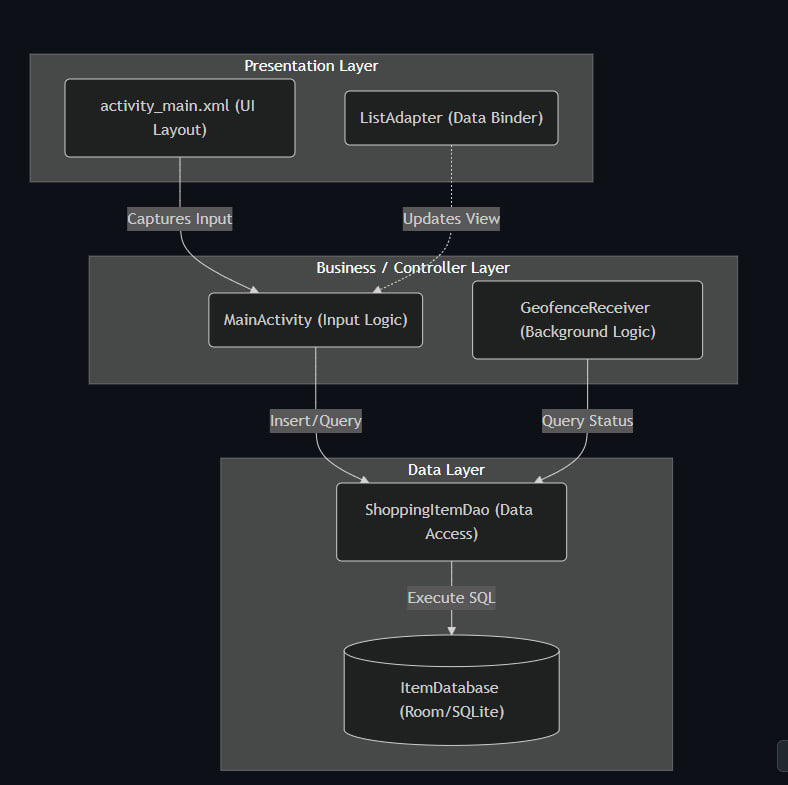
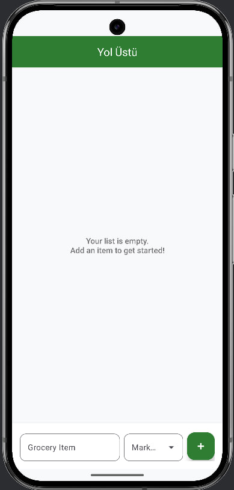
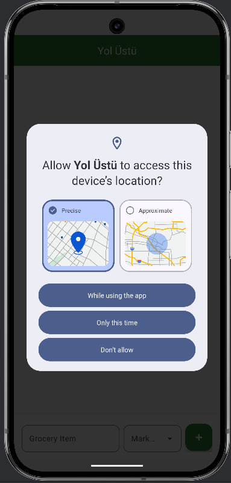
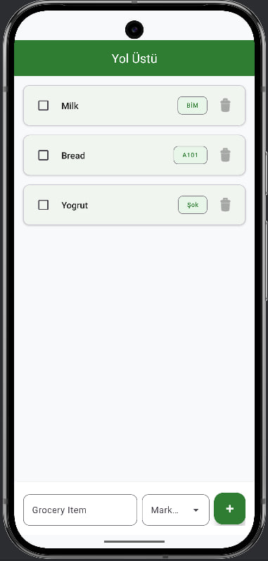
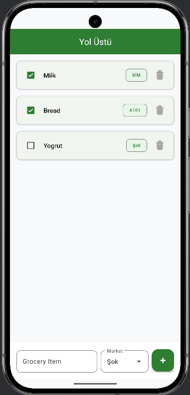

# Title Page
**Document:** Software Architecture Document

**Project:** Yol Üstü (Location-based Groceries Reminder)

## Table of Contents
* [1. Scope](#1-scope)
* [2. References](#2-references)
* [3. Software Architecture](#3-software-architecture)
* [4. Architectural Goals & Constraints](#4-architectural-goals--constraints)
* [5. Logical Architecture](#5-logical-architecture)
* [6. Process Architecture](#6-process-architecture)
* [7. Development Architecture](#7-development-architecture)
* [8. Physical Architecture](#8-physical-architecture)
* [9. Scenarios](#9-scenarios)
* [10. Size and Performance](#10-size-and-performance)
* [11. Quality](#11-quality)
* [12. Appendices](#appendices)

## List of Figures
| Figure No | Description | Section Reference |
| :--- | :--- | :--- |
| **Figure 1** | Main UI Screen| [5. Logical Architecture](#5-logical-architecture) |
| **Figure 2** | Location Permission Screen| [9. Scenarios](#9-scenarios) |
| **Figure 3** | Saved List Screen| [9. Scenarios](#9-scenarios) |
| **Figure 4** | Mark Items Screen| [9. Scenarios](#9-scenarios) |

## 1. Scope
This document details the software architecture of the Yol Üstü mobile application. Yol Üstü is a location-aware Android shopping list designed to cross-reference user-defined grocery items with the real-world physical locations of supermarkets (e.g., BİM, A101, Şok).

The scope of this document covers the internal structure of the local Android client, detailing the integration of the Room database for local storage and Google Play Services for background geofencing.

## 2. References
* Kruchten, P.B. (1995). "The 4+1 View Model of architecture". IEEE Software. 

* Android Developers Documentation: Geofencing API and Background Location Limits. 

* Android Developers Documentation: Save data in a local database using Room.

## 3. Software Architecture
**Documentation Style used**

The architecture of Yol Üstü is documented using the Kruchten 4+1 View Model. This framework allows us to dissect the system from the perspectives of different stakeholders (end-users, developers, system engineers) by separating the system into Logical, Process, Development, and Physical views, unified by core Use Case Scenarios.

**How does UI and Backend Interact**

The application strictly follows a Model-View-Controller (MVC) flow to manage interactions between the user interface and the local backend (Room Database). When a user inputs a new grocery item, the View (`activity_main.xml`) captures the data and sends it to the Controller (`MainActivity.java`). The Controller processes this input and asynchronously calls the Data Access Object (`ShoppingItemDao`) within the Model layer. The Model then executes the SQL query to persist the data in the local SQLite Database. Once saved, the Controller updates the `ListAdapter` to refresh the View.

*Below is a UML Layered Diagram illustrating this UI-to-Backend interaction:*

## 4. Architectural Goals & Constraints
**Goals**
* Battery Efficiency: The primary goal is to provide background location tracking without causing noticeable battery drain.

* Offline Capability: The app must function entirely offline, storing all shopping list data and market coordinates locally.

**Constraints**
- OS Restrictions: The architecture is heavily constrained by Android's strict background processing and location permission rules (Android 10+).

- Local Storage: Because there is no external backend/cloud server, all data persistence is constrained to the device's physical hardware capacity.

## 5. Logical Architecture
* Our logical architecture follows the Model-View-Controller (MVC) pattern to separate the application's internal data from the user interface. This separation of concerns ensures that our location tracking logic does not interfere with the UI thread.

* The Model: Represents the application's data layer. We utilize a local SQLite database (managed via Android Room) to define the ShoppingItem entities. This layer handles the storage and retrieval of user-entered grocery items and their associated market locations.

* The View: Represents the user interface. Built using Android XML layouts (activity_main.xml) and a RecyclerView with a custom ListAdapter, this layer strictly observes the data and renders the current shopping list to the user. It contains no heavy business logic.

*Figure 1: The application's main user interface.*

* The Controller: Acts as the bridge between the View and the Model.

* MainActivity.java captures user input from the UI and commands the Model to update the database.

* Additionally, our GeofenceReceiver.java acts as an event-driven controller, listening for location broadcasts from the Android OS to trigger background notifications.

## 6. Process Architecture
This section outlines how the application operates in the background and manages system resources during active use.

**6.1 Background Lifecycle Management**

* To prioritize battery longevity, the application employs an event-driven architecture rather than maintaining a constant foreground presence. This is achieved through the Android Geofencing API:

  - Idle State: The application process remains dormant when the user is outside the vicinity of a registered store, consuming negligible resources.
  
  - System-Level Monitoring: Instead of taxing the battery with frequent GPS polling, the application delegates location tracking to the Android OS, which optimizes power consumption at the system level.

**6.2 The Geofence Receiver Logic**

* The GeofenceReceiver.java component serves as the backbone of the app’s background functionality, managing the transition from location detection to user engagement:

  - Wake-up Trigger: The OS broadcasts an "Intent" the moment a user crosses a predefined boundary (such as a BİM storefront).

  - Instant Execution: The GeofenceReceiver activates momentarily to intercept this signal and confirm a GEOFENCE_TRANSITION_ENTER event.

  - Notification Delivery: After validation, the receiver invokes the system’s Notification Manager. This ensures the user receives their alert promptly, even if the application has been cleared from the recent tasks list.

## 7. Development Architecture
The development architecture defines the software's static organization. For Yol Üstü, we utilize a standard Android Gradle build system structure.

* **Data Persistence Layer:** We implement the Android Architecture Components Room library as an abstraction layer over SQLite. This ensures robust local data storage for our `ShoppingItem` entities and provides compile-time verification of SQL queries, minimizing runtime database crashes.

**7.1 Design Choices & Technical Debates**

During development, our team faced several architectural decisions.

**Balancing Battery Life and Precision**
* Our primary technical hurdle involved optimizing location tracking. While we initially weighed the merits of continuous GPS polling for high-resolution coordinates, it became clear that the resulting power consumption would lead to a poor user experience and high churn. To solve this, we integrated the Google Play Services Geofencing API. By offloading the monitoring to the Android system and only triggering the app when specific boundaries are breached, we achieved a sustainable equilibrium between notification accuracy and battery conservation.

**Evaluating Local Storage Solutions**
* We also carefully considered whether to utilize SharedPreferences, standard SQLite, or the Room Persistence Library for managing shopping data. SharedPreferences proved insufficient for the complex relational requirements of linking items to geographic data, and while raw SQLite was a viable engine, the manual overhead was excessive. We ultimately selected Room; its ability to provide compile-time query validation and its seamless fit with modern Android design patterns allowed us to minimize structural bugs and significantly shorten our development cycle.

**7.2 File Structure & Descriptions**

Below is a breakdown of the core files written for this project and their specific responsibilities:

* `MainActivity.java`: The main entry point of the application. It initializes the UI, checks for necessary location permissions, and hosts the `RecyclerView` that displays the active shopping list.

* `GeofenceReceiver.java`: A `BroadcastReceiver` that runs in the background. It listens for transition events from the Google Play Services API (specifically, entering a geofenced area) and triggers the local push notification.

* `ItemDatabase.java`: Contains the Room Database configuration. It defines the SQLite database instance and provides the Data Access Object (DAO) connections.

* `ShoppingItem.java`: The entity class representing a single grocery item. It defines the table structure, including columns for the item name, associated store, and a boolean for its completed status.

* `ListAdapter.java`: Manages the data binding for the user interface. It takes the list of items from the database and inflates the individual XML row layouts for the main screen.

* `activity_main.xml`: The primary frontend layout file, designed using Material Design guidelines to provide a clean and intuitive user experience.

## 8. Physical Architecture
The physical architecture maps the software components to the hardware of the mobile device. Yol Üstü operates entirely on the user's Android smartphone without relying on external cloud servers for core business logic.
* **Device Hardware:** The application interfaces directly with the device's physical GPS receiver and location sensors.

* **Power Management:** To mitigate the high battery drain typical of continuous GPS polling, the application utilizes the hardware's low-power geofencing capabilities. The Android OS offloads the boundary monitoring to the physical modem/sensor hub, waking the main CPU only when a geographic threshold is crossed.

* **Storage:** Data is persisted physically on the device's internal flash memory using the Room SQLite database.

## 9. Scenarios
To validate our architecture, we define the following core scenario (the "+1" of our view model), which illustrates how the logical, process, development, and physical views interact during a standard user journey:

**Scenario 1:**  Adding an Item and Triggering a Geofence Notification

* User Input (Logical/View): The user opens the application and types "Milk" into the activity_main.xml input field and selects "BİM" as the target market.

* Data Storage (Development/Model): The controller (MainActivity.java) receives this input and writes a new ShoppingItem record into the local SQLite database.

* Hardware Registration (Physical): The application registers a geofence with the physical device's GPS hardware using the predefined coordinates for the selected market. The user then closes the application.

* Background Processing (Process): The application enters an idle state. Later, when the user physically walks within a 100-meter radius of the BİM coordinates, the Android OS broadcasts a location event.

* Event Handling & Notification (Process/Controller): The GeofenceReceiver.java wakes up in the background, intercepts the broadcast, and pushes a high-priority notification to the user's lock screen reminding them to buy "Milk".

*Figure 2: a picture showing the Geofence Notification permission:*

**Scenario 2: Viewing the Saved List on Application Startup**
* User Input (Logical/View): The user launches the Yol Üstü application from their home screen.

* Data Retrieval (Development/Model): The `MainActivity` (Controller) requests all saved items from the local Room Database via the `ShoppingItemDao`.

* UI Update (Logical/View): The database returns the list of `ShoppingItem` objects. The `ListAdapter` binds this data to the `RecyclerView`, instantly displaying the user's pending grocery list on the screen.

*Figure 3: a picture showing the saved list after entering the application:*

**Scenario 3: Marking a Grocery Item as Completed**
* User Input (Logical/View): The user taps the checkbox next to "Milk" on the main screen to mark it as bought.

* Data Modification (Development/Model): The `ListAdapter` captures the click and notifies the Controller of the state change. The Controller sends an update command to the `ShoppingItemDao`.

* Background Processing (Process): The database updates the boolean "completed" status for that specific item.

* Hardware Adjustment (Physical): If the user completes the final item associated with "BİM", the application communicates with the device's GPS hardware to unregister the geofence for that specific market, conserving battery power.

*Figure 4: a picture showing the saved list after entering the application:* 

## 10. Size and Performance
**Size**
* The application footprint is expected to be minimal (under 20MB), as it relies primarily on native Android libraries and does not package heavy external media assets.

**Performance**
* The critical performance metric is the geofence transition latency. The system is designed to trigger a local notification within 1-2 minutes of the device's GPS hardware registering a boundary breach, dependent on the OS's internal hardware polling interval.

## 11. Quality
To ensure system quality, the architecture prioritizes Reliability and Maintainability. Reliability is addressed by utilizing the robust Room database to prevent SQL injection and data corruption. Maintainability is achieved through strict adherence to the MVC design pattern, ensuring that UI updates, data storage, and background location services are thoroughly decoupled.

## Appendices

### Acronyms and Abbreviations
* MVC: Model-View-Controller

* API: Application Programming Interface

* GPS: Global Positioning System

* OS: Operating System

* PR: Pull Request

* TBA: To Be Added

### Definitions
* Geofence: A virtual geographic boundary defined by GPS coordinates and a specific radius.

* Room: An Android library that provides an abstraction layer over SQLite to allow fluent database access.

* BroadcastReceiver: An Android component that allows an application to register for system or application events.

### Design Principles
* Separation of Concerns: Distinct layers for the user interface, business logic, and data access.

* Event-Driven Execution: Utilizing system broadcasts rather than infinite loops to save system resources.
